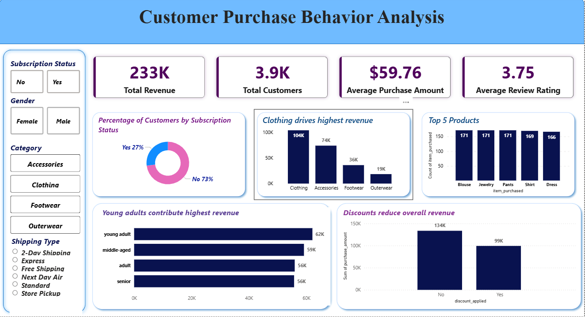

# Customer Purchase Behavior Analysis

## Problem
Analyze customer transaction data to understand what drives revenue, how different customer segments behave, and how factors like age, category, and discounts influence purchasing decisions.

---

## Dataset
- ~3.9K records with 18 features  
- Includes customer demographics, transactions, and product data  

---

## Tools Used
- Python (Pandas)
- MySQL
- Power BI

---

## Approach
- Cleaned and transformed data using Python  
- Created features like age groups and purchase frequency  
- Performed SQL analysis to answer business questions  
- Built Power BI dashboard for visualization
- Focused on answering real business questions rather than just exploring the dataset

---

## Key Insights
- Clothing category consistently generates the highest revenue among all product types  
- Young adult customers contribute the largest share of total revenue 
- Discounts increase purchase volume but not overall revenue  
- Loyal customers contribute majority of revenue  

---

## Business Impact
- Helps improve customer targeting and segmentation  
- Supports better pricing and promotion strategies  
- Enables data-driven decision-making  

---

## Dashboard

---

## Project Assets
- 📄 [Detailed Report](docs/customer_analysis_report.pdf)  
- 📊 [Presentation Slides](docs/project_presentation.pptx)  
- 📝 [Problem Statement](docs/problem_statement.pdf)  
